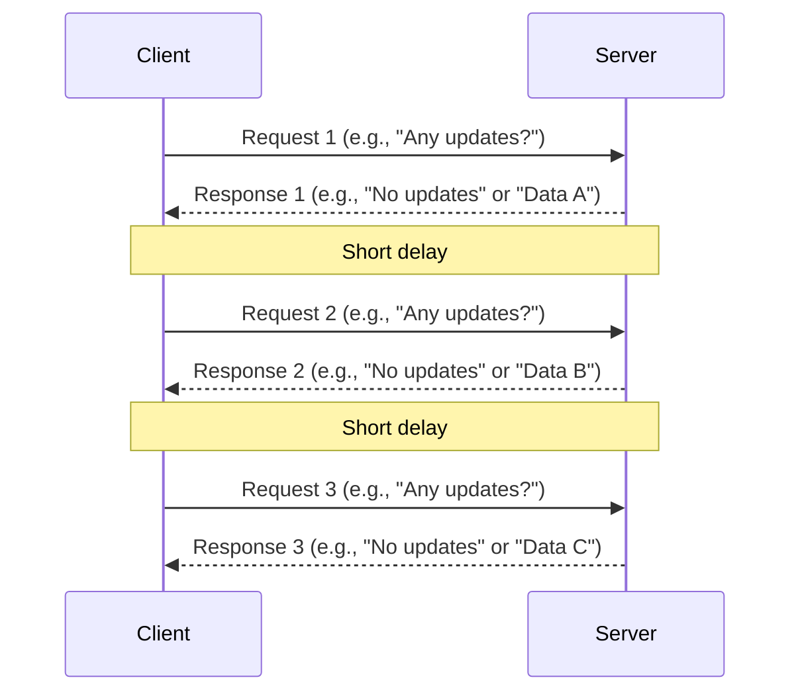

Sequence Diagrams for HTTP Communication PatternsThis document illustrates the sequence of interactions between a client and a server for three common HTTP communication patterns: Polling, Long Polling, and WebSockets.1. PollingPolling is a technique where the client repeatedly sends requests to the server to check for new data. If there is no new data, the server responds with an empty or "no new data" message. This can be inefficient as it generates a lot of unnecessary requests.

2. Long PollingLong Polling is an improvement over traditional polling. The client sends a request to the server, and if the server doesn't have new data immediately, it holds the connection open until new data becomes available or a timeout occurs. Once data is available, the server sends the response and closes the connection. The client then immediately opens a new connection. This reduces the number of requests compared to short polling.sequenceDiagram
    participant Client
    participant Server

    Client->>Server: Request 1 (e.g., "Get updates")
    Note over Server: Server holds connection until data is available or timeout
    Server-->>Client: Response 1 (Data A)
    Note over Client,Server: Client immediately sends new request
    Client->>Server: Request 2 (e.g., "Get updates")
    Note over Server: Server holds connection
    Server-->>Client: Response 2 (Data B)
    Note over Client,Server: Client immediately sends new request
    Client->>Server: Request 3 (e.g., "Get updates")
    Note over Server: Server holds connection
    Server-->>Client: Response 3 (Data C)
3. WebSocketsWebSockets provide a full-duplex communication channel over a single TCP connection. After an initial HTTP handshake, the connection is upgraded to a WebSocket, allowing both the client and server to send messages to each other at any time without the need for repeated requests. This is ideal for real-time applications.sequenceDiagram
    participant Client
    participant Server

    Client->>Server: HTTP Handshake (Upgrade to WebSocket)
    Server-->>Client: HTTP Handshake Response (101 Switching Protocols)
    Note over Client,Server: WebSocket connection established
    Server->>Client: Message from Server (e.g., "Event 1 occurred")
    Client->>Server: Message from Client (e.g., "Action A completed")
    Server->>Client: Message from Server (e.g., "Event 2 occurred")
    Client->>Server: Message from Client (e.g., "Action B completed")
    Note over Client,Server: Bi-directional communication continues until connection is closed
