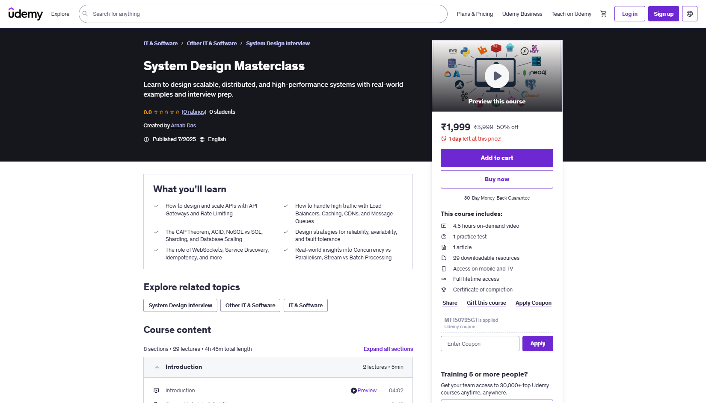

<h1 align="center"><a href="https://www.udemy.com/course/system-design-using-python"> System Design Masterclass </a></h1>

<div align="center">
  
</div>

## Overview

A comprehensive collection of system design concepts, algorithms, and practical implementations covering the fundamental building blocks of scalable distributed systems. This repository serves as a complete learning resource for understanding system design principles through hands-on examples and theoretical concepts.

## Project Structure

### 01 Foundations of System Design
- **APIs**: REST, GraphQL, and gRPC implementations
  - `RestAPI/` - FastAPI-based REST API examples
  - `GraphQL/` - GraphQL with FastAPI and Strawberry
  - `gRPC/` - Protocol Buffers and gRPC server/client examples

### 02 Load Handling, Caching & Content Delivery
- **Load Balancing Algorithms**: Practical implementations of various load balancing strategies
  - `01 Round Robin.py` - Basic round-robin load balancing
  - `02 Weighted Round Robin.py` - Weighted round-robin algorithm
  - `03 Least Connections.py` - Least connections load balancing
  - `04 Least Response Time.py` - Response time-based load balancing
  - `05 IP Hash.py` - IP hash-based load balancing

### 03 Data at Scale Storage, Indexing, and Databases
- Database concepts and implementations (currently under development)

### 04 Communication Between Systems
- **Bloom Filters**: Memory-efficient probabilistic data structure
  - `22 Bloom Filters.py` - Complete Bloom filter implementation
  - `22 Bloom Filters_1.py` - Alternative implementation
- **Rate Limiting Algorithms**: Various rate limiting strategies
  - `fixed_window_counter.py` - Fixed window rate limiting
  - `sliding_window_counter.py` - Sliding window counter
  - `sliding_window_log.py` - Sliding window log
  - `leaky_bucket.py` - Leaky bucket algorithm
  - `token_bucket.py` - Token bucket algorithm
- **WebSockets**: Real-time communication documentation
  - `websockets.md` - WebSocket concepts and usage

### 05 Architecture, Optimization & Final Touches
- **Concurrency vs. Parallelism**: Interactive comparison
  - `Concurrency vs. Parallelism Comparison.html` - Visual comparison with examples

## Key Learning Areas

### API Design & Implementation
- **REST APIs**: Modern FastAPI-based RESTful services
- **GraphQL**: Type-safe GraphQL APIs with automatic documentation
- **gRPC**: High-performance RPC framework with Protocol Buffers

### Load Balancing & Scalability
- **Round Robin**: Simple request distribution
- **Weighted Round Robin**: Capacity-aware load distribution
- **Least Connections**: Connection-based load balancing
- **Least Response Time**: Performance-based routing
- **IP Hash**: Consistent request routing

### System Communication
- **Bloom Filters**: Efficient membership testing with configurable false positives
- **Rate Limiting**: Multiple algorithms for API protection
- **WebSockets**: Real-time bidirectional communication

### Performance & Optimization
- **Concurrency vs. Parallelism**: Understanding execution models
- **Caching Strategies**: Various caching approaches
- **Database Scaling**: Sharding and distribution techniques

## Getting Started

### Prerequisites
- Python 3.7+
- pip (Python package manager)

### Installation

1. **Clone the repository**
   ```bash
   git clone https://github.com/raj713335/System_Design_Masterclass.git
   cd System_Design_Masterclass
   ```

2. **Install dependencies for specific modules**

   **For REST API examples:**
   ```bash
   pip install fastapi uvicorn
   ```

   **For GraphQL examples:**
   ```bash
   pip install fastapi uvicorn strawberry-graphql
   ```

   **For gRPC examples:**
   ```bash
   pip install grpcio grpcio-tools
   ```

   **For Bloom Filters:**
   ```bash
   pip install bitarray
   ```

### Running Examples

#### REST API (FastAPI)
```bash
cd "01 Foundations of System Design/01 APIs/RestAPI"
uvicorn main:app --reload
```
Visit: http://localhost:8000/docs

#### GraphQL
```bash
cd "01 Foundations of System Design/01 APIs/GraphQL"
uvicorn main:app --reload
```
Visit: http://localhost:8000/graphql

#### gRPC
```bash
cd "01 Foundations of System Design/01 APIs/gRPC"
# Generate protobuf files
python -m grpc_tools.protoc -I. --python_out=. --grpc_python_out=. greet.proto
# Start server
python greeter_server.py
# In another terminal, run client
python greeter_client.py
```

#### Load Balancing Algorithms
```bash
cd "02 Load Handling, Caching & Content Delivery/07 Load Balancing Algorithms"
python "01 Round Robin.py"
```

#### Rate Limiting
```bash
cd "04 Communication Between Systems/23 Rate Limiting Algorithms"
python fixed_window_counter.py
```

#### Bloom Filters
```bash
cd "04 Communication Between Systems/22 Bloom Filters"
python "22 Bloom Filters.py"
```

## Visual Resources

The project includes comprehensive visual aids in the `Data/` directory:

### Architecture Diagrams
- API Gateway patterns
- CAP Theorem illustrations
- Load balancing strategies
- Caching strategies and eviction policies
- Database sharding approaches
- WebSocket architectures
- Single Point of Failure (SPOF) analysis
- Idempotency patterns

### Presentation Materials
- PowerPoint presentations for each topic
- Interactive HTML comparisons
- Detailed diagrams in Draw.io format

## Learning Path

### Beginner Level
1. Start with REST API fundamentals
2. Understand basic load balancing (Round Robin)
3. Learn about rate limiting basics
4. Explore caching concepts

### Intermediate Level
1. Dive into GraphQL and gRPC
2. Implement advanced load balancing algorithms
3. Master Bloom filters and probabilistic data structures
4. Understand WebSocket communication

### Advanced Level
1. Study database sharding and scaling
2. Implement complex rate-limiting strategies
3. Analyze concurrency vs. parallelism
4. Design fault-tolerant architectures

## Customization

### Adding New Algorithms
1. Create a new Python file in the appropriate directory
2. Follow the existing naming conventions
3. Include comprehensive documentation
4. Add example usage in the code

### Extending Examples
- Modify existing implementations to suit your needs
- Add new test cases and edge conditions
- Implement additional algorithms following the same patterns

## Contributing

1. Fork the repository
2. Create a feature branch
3. Add your implementation or improvement
4. Include proper documentation
5. Submit a pull request

## License

This project is licensed under the GNU Lesser General Public License v2.1 - see the [LICENSE](LICENSE) file for details.

## Educational Value

This masterclass provides:
- **Practical implementations** of theoretical concepts
- **Hands-on examples** for immediate application
- **Visual learning aids** for complex concepts
- **Progressive difficulty** from basic to advanced topics
- **Real-world scenarios** and use cases

## 🔗 Related Resources

- [FastAPI Documentation](https://fastapi.tiangolo.com/)
- [GraphQL Official Site](https://graphql.org/)
- [gRPC Documentation](https://grpc.io/docs/)
- [System Design Primer](https://github.com/donnemartin/system-design-primer)

## Support

For questions, issues, or contributions, please:
1. Check existing documentation
2. Review example implementations
3. Open an issue with a detailed description
4. Provide code examples for bugs

---

# Happy Learning! 

*Master the art of designing scalable, reliable, and efficient distributed systems.*
